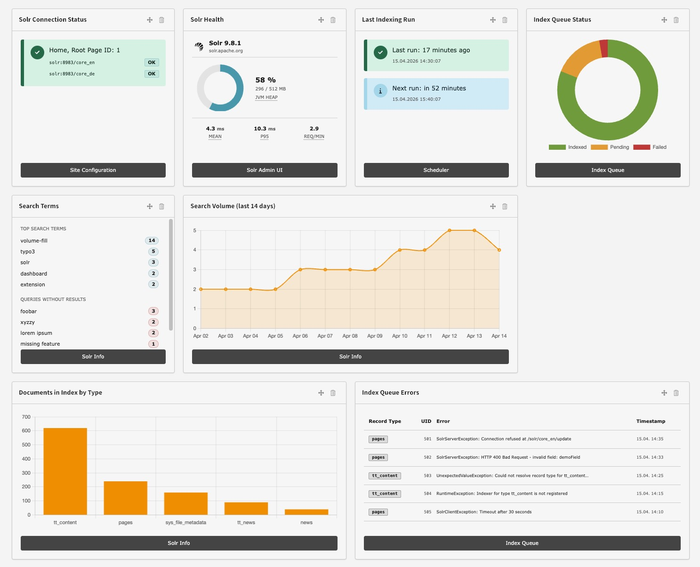
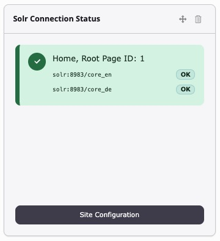
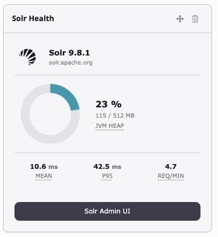
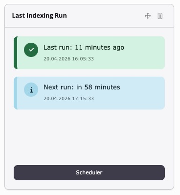
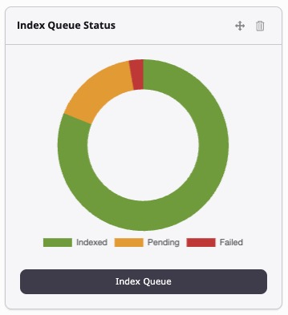
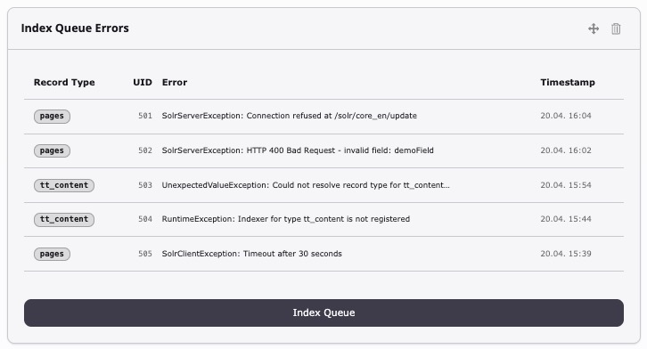
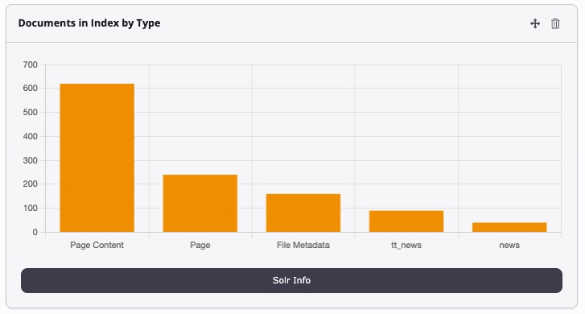
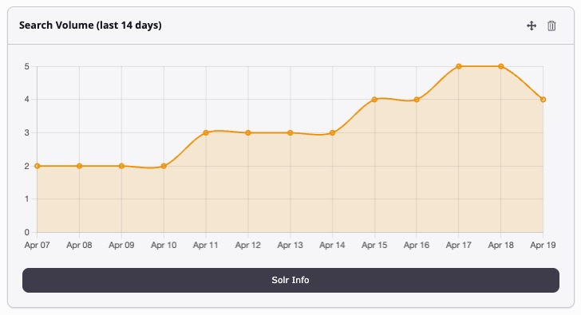
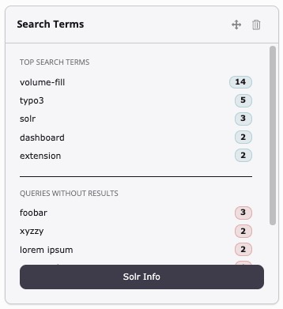
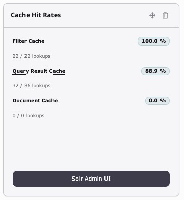

<div align="center">


# TYPO3 extension `typo3_solr_dashboard_widgets`

[](https://extensions.typo3.org/extension/typo3_solr_dashboard_widgets)
[](https://extensions.typo3.org/extension/typo3_solr_dashboard_widgets)
[](https://packagist.org/packages/konradmichalik/typo3-solr-dashboard-widgets)

[](https://coveralls.io/github/konradmichalik/typo3-solr-dashboard-widgets)
[](https://github.com/konradmichalik/typo3-solr-dashboard-widgets/actions/workflows/cgl.yml)
[](https://github.com/konradmichalik/typo3-solr-dashboard-widgets/actions/workflows/tests.yml)
[](LICENSE.md)

</div>

This extension adds a ready-to-use **Solr Overview** dashboard to the TYPO3 backend with a set of widgets that surface the most relevant information about your [EXT:solr](https://extensions.typo3.org/extension/solr) installation at a glance:



- **Connection & Health** — live ping status per site/core and JVM/query metrics
- **Indexing** — queue status, errors, last and next scheduler run
- **Search** — volume trend, top queries, queries without results
- **Index content** — document counts per type across all cores
- **Caching** — Solr cache hit rates

> [!WARNING]
> Warning
> This package is in early development stage and may change significantly in the future. I am working steadily to release a stable version as soon as possible.

> [!NOTE]
> Props to the [**Apache Solr for TYPO3**](https://github.com/TYPO3-Solr/ext-solr) team — this extension stands entirely on their shoulders. Everything you see here is just a different lens on the data [EXT:solr](https://extensions.typo3.org/extension/solr) already provides.

## 🔥 Installation

### Requirements

* TYPO3 13.4 or 14.x
* PHP 8.2+
* [EXT:solr](https://extensions.typo3.org/extension/solr) ^13.0 or ^14.0-alpha
* `typo3/cms-dashboard`

### Composer

[](https://packagist.org/packages/konradmichalik/typo3-solr-dashboard-widgets)
[](https://packagist.org/packages/konradmichalik/typo3-solr-dashboard-widgets)

```bash
composer require konradmichalik/typo3-solr-dashboard-widgets
```

### TER

[](https://extensions.typo3.org/extension/typo3_solr_dashboard_widgets)
[](https://extensions.typo3.org/extension/typo3_solr_dashboard_widgets)

Download the zip file from [TYPO3 extension repository (TER)](https://extensions.typo3.org/extension/typo3_solr_dashboard_widgets).

### Setup

```bash
vendor/bin/typo3 extension:setup --extension=typo3_solr_dashboard_widgets
```

Open **Dashboard** in the TYPO3 backend, click **+** in a tab strip and pick **Solr Overview** from the presets.

## 🧰 Widgets

All widgets appear in a dedicated **Apache Solr** group in the "Add widget" dialog. Each widget reads data from Solr and/or EXT:solr directly — no persistent state of its own is stored.

| Widget | Source |
|--------|--------|
| [Connection Status](#connection-status) | EXT:solr connections |
| [Solr Health](#solr-health) | Solr `/admin/metrics` + `/admin/info/system` |
| [Last Indexing Run](#last-indexing-run) | `tx_scheduler_task` |
| [Index Queue Status](#index-queue-status) | `tx_solr_indexqueue_item` |
| [Index Queue Errors](#index-queue-errors) | `tx_solr_indexqueue_item` |
| [Documents in Index by Type](#documents-in-index-by-type) | Solr facet API |
| [Search Volume (last 14 days)](#search-volume-last-14-days) | `tx_solr_statistics` |
| [Search Terms](#search-terms) | `tx_solr_statistics` |
| [Cache Hit Rates](#cache-hit-rates) | Solr `/admin/metrics` |

### [Connection Status](Classes/Widgets/ConnectionStatusWidget.php)



One card per configured TYPO3 site, listing every Solr core with a live ping result (`OK` / `offline`). Reaches out to Solr on every dashboard refresh.

### [Solr Health](Classes/Widgets/SolrHealthWidget.php)



Combined node-level health check:

- **Solr version** with a link to the upstream project page
- **JVM heap** donut (used / max) with traffic-light color shift at 70 % / 85 %
- **Mean / p95 response time** and **requests per minute** aggregated across all cores

Data is pulled from Solr's `/admin/metrics` and `/admin/info/system` endpoints, cached for the request.

### [Last Indexing Run](Classes/Widgets/LastIndexingRunWidget.php)



Shows the most recent execution of any Solr-related scheduler task (e.g. `IndexQueueWorkerTask`) with a human-readable "N minutes ago" and a status badge (OK / warning / error based on age thresholds). Also lists the next scheduled run.

> [!TIP]
> The footer button navigates to the **Scheduler** module. The widget resolves the correct route identifier for both TYPO3 v13 (`scheduler_manage`) and v14 (`scheduler`) automatically.

### [Index Queue Status](Classes/Widgets/IndexQueueStatusWidget.php)



Doughnut chart of `tx_solr_indexqueue_item` entries grouped into *Indexed* / *Pending* / *Failed*.

### [Index Queue Errors](Classes/Widgets/IndexQueueErrorsWidget.php)



Table of the most recent queue entries with a non-empty `errors` column, including record type, uid, truncated error message (full text on hover), and timestamp.

### [Documents in Index by Type](Classes/Widgets/DocumentsInIndexWidget.php)



Bar chart of document counts **per `type` field value**, aggregated across all reachable cores via Solr's facet API (`facet.field=type`). Reflects what is actually in the index, not what is waiting in the TYPO3 queue.

### [Search Volume (last 14 days)](Classes/Widgets/SearchVolumeWidget.php)



Line chart of daily search volume over the last 14 days, read from `tx_solr_statistics`.

> [!IMPORTANT]
> Statistics logging must be enabled in TypoScript for this widget to show data:
> ```
> plugin.tx_solr.statistics = 1
> ```

### [Search Terms](Classes/Widgets/SearchTermsWidget.php)



Two stacked lists: **Top Queries** (top 5 by count) and **Queries Without Results**. Uses the same `tx_solr_statistics` data source as Search Volume — the same TypoScript flag is required.

### [Cache Hit Rates](Classes/Widgets/CacheHitRatesWidget.php)



> [!NOTE]
> The three Solr searcher caches:
> - **Filter Cache** — stores results of filter queries (`fq`). A low hit rate often means highly unique or frequently changing filter combinations.
> - **Query Result Cache** — caches ordered document-ID lists for query + sort combinations. Drops when users rarely repeat the same search.
> - **Document Cache** — caches stored-field lookups by document ID. Low rates indicate many unique documents being fetched (typically fine for diverse indices).

Aggregated hit ratios shown as progress bars. Useful for spotting cache tuning opportunities.

## 🎯 Dashboard preset

The extension ships a **Solr Overview** preset (`solrOverview`) that arranges the eight default widgets in the following order:

*Connection Status · Solr Health · Last Indexing Run · Search Terms · Index Queue Status · Search Volume · Documents in Index · Index Queue Errors*

New dashboards → **+** → **Solr Overview**.

## 🙌 Credits

- [**Apache Solr for TYPO3**](https://github.com/TYPO3-Solr/ext-solr) — every bit of data surfaced by this dashboard (index queue, statistics table, Solr connection objects, scheduler task) originates from the [EXT:solr](https://extensions.typo3.org/extension/solr) team's work.
- [**Apache Solr**](https://solr.apache.org/) — the search platform itself and its admin `/metrics` + `/admin/info/system` endpoints, which power the Solr Health and Cache Hit Rates widgets.

## 🧑‍💻 Contributing

Please have a look at [`CONTRIBUTING.md`](CONTRIBUTING.md).

## ⭐ License

This project is licensed under [GNU General Public License 2.0 (or later)](LICENSE.md).
